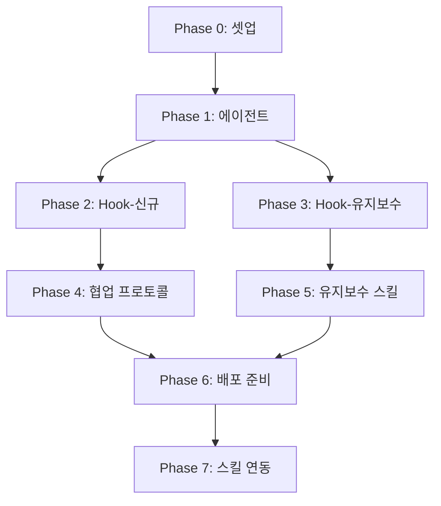

# Claude Project Team Extension - TASKS.md

> **생성일**: 2026-02-07
> **설계 문서**: `docs/design/PROJECT-TEAM-AGENTS.md`
> **목표**: Hook + Agent 방식의 Claude Extension 구현

---

## Phase 0: 프로젝트 셋업

### [x] P0-T1: 설계 문서 완료
- **담당**: 사용자 + Claude
- **산출물**:
  - `docs/design/PROJECT-TEAM-AGENTS.md`
  - `docs/design/PROJECT-TEAM-SIMULATION.md`
- **상태**: 완료

### [x] P0-T2: 배포용 디렉토리 구조 생성
- **담당**: orchestrator
- **산출물**:
  ```
  claude-project-team/
  ├── install.sh
  ├── hooks/
  ├── agents/
  ├── templates/
  ├── skills/
  └── docs/
  ```
- **Worktree**: 불필요 (main 브랜치)

---

## Phase 1: 에이전트 정의

> **목표**: 프로젝트/도메인 레벨 에이전트 및 유지보수 에이전트 정의

### [x] P1-T1: 프로젝트 레벨 에이전트 생성 (5개)
- **담당**: backend-specialist
- **산출물**:
  - `agents/ProjectManager.md`
  - `agents/ChiefArchitect.md`
  - `agents/ChiefDesigner.md`
  - `agents/QAManager.md`
  - `agents/DBA.md`
- **참조**: 설계 문서 Section 3
- **Worktree**: `worktree/phase-1-agents`

### [x] P1-T2: 도메인 레벨 에이전트 템플릿 생성 (3개)
- **담당**: backend-specialist
- **산출물**:
  - `agents/templates/PartLeader.md`
  - `agents/templates/DomainDesigner.md`
  - `agents/templates/DomainDeveloper.md`
- **참조**: 설계 문서 Section 4
- **의존성**: P1-T1

### [x] P1-T3: 유지보수 분석가 에이전트 생성
- **담당**: backend-specialist
- **산출물**:
  - `agents/MaintenanceAnalyst.md`
- **참조**: 설계 문서 Section 12.7
- **의존성**: P1-T1

---

## Phase 2: Hook 시스템 (신규 개발)

> **목표**: 권한, 표준, 품질 검증을 위한 Hook 스크립트 구현

### [x] P2-T1: permission-checker 구현
- **담당**: backend-specialist
- **산출물**: `hooks/permission-checker.js`
- **기능**:
  - 에이전트 역할별 파일 접근 권한 검증
  - Permission Matrix 기반 차단/경고
- **참조**: 설계 문서 Section 6.1
- **Worktree**: `worktree/phase-2-hooks`

### [x] P2-T2: standards-validator 구현
- **담당**: backend-specialist
- **산출물**: `hooks/standards-validator.js`
- **기능**:
  - 코딩 컨벤션 검증
  - 아키텍처 표준 검증
  - 네이밍 규칙 검증
- **참조**: 설계 문서 Section 6.2
- **의존성**: P2-T1

### [x] P2-T3: design-validator 구현
- **담당**: frontend-specialist
- **산출물**: `hooks/design-validator.js`
- **기능**:
  - 디자인 시스템 준수 검증
  - 컬러/타이포/스페이싱 검증
- **참조**: 설계 문서 Section 6.3
- **의존성**: P2-T1

### [x] P2-T4: quality-gate 구현
- **담당**: test-specialist
- **산출물**: `hooks/quality-gate.js`
- **기능**:
  - Phase 완료 전 품질 검증
  - 테스트 커버리지 체크
  - 린트 통과 확인
- **참조**: 설계 문서 Section 6.4
- **의존성**: P2-T2

### [x] P2-T5: interface-validator 구현
- **담당**: backend-specialist
- **산출물**: `hooks/interface-validator.js`
- **기능**:
  - 도메인 간 Interface Contract 검증
  - 스펙 변경 시 영향 분석
- **참조**: 설계 문서 Section 6.5
- **의존성**: P2-T2

### [x] P2-T6: cross-domain-notifier 구현
- **담당**: backend-specialist
- **산출물**: `hooks/cross-domain-notifier.js`
- **기능**:
  - 스펙 변경 시 관련 도메인 알림
  - 디자인 변경 시 프론트엔드 알림
- **참조**: 설계 문서 Section 6.6
- **의존성**: P2-T5

---

## Phase 3: Hook 시스템 (유지보수)

> **목표**: 프로덕션 유지보수를 위한 Hook 스크립트 구현

### [x] P3-T1: pre-edit-impact-check 구현
- **담당**: backend-specialist
- **산출물**: `hooks/pre-edit-impact-check.js`
- **기능**:
  - 파일 수정 전 영향도 분석
  - 위험 영역 경고
  - 연관 파일 목록 제공
- **참조**: 설계 문서 Section 12.2
- **Worktree**: `worktree/phase-3-maintenance`

### [x] P3-T2: risk-area-warning 구현
- **담당**: backend-specialist
- **산출물**: `hooks/risk-area-warning.js`
- **기능**:
  - CRITICAL/HIGH 위험 영역 감지
  - 수정 전 확인 요청
  - 위험 사유 안내
- **참조**: 설계 문서 Section 12.3
- **의존성**: P3-T1

### [x] P3-T3: architecture-updater 구현
- **담당**: backend-specialist
- **산출물**: `hooks/architecture-updater.js`
- **기능**:
  - 코드 변경 후 아키텍처 맵 자동 업데이트
  - 의존성 그래프 갱신
- **참조**: 설계 문서 Section 12.1
- **의존성**: P3-T1

### [x] P3-T4: changelog-recorder 구현
- **담당**: backend-specialist
- **산출물**: `hooks/changelog-recorder.js`
- **기능**:
  - 파일 수정 시 자동 변경 이력 기록
  - 영향 받은 도메인 추적
- **참조**: 설계 문서 Section 12.5
- **의존성**: P3-T3

---

## Phase 4: 협업 프로토콜

> **목표**: 에이전트 간 통신 템플릿 및 계약 정의

### [x] P4-T1: 요청/응답 템플릿 생성
- **담당**: docs-specialist
- **산출물**:
  - `templates/protocol/request.md`
  - `templates/protocol/response.md`
  - `templates/protocol/handoff.md`
- **참조**: 설계 문서 Section 7
- **Worktree**: `worktree/phase-4-protocol`

### [x] P4-T2: ADR 템플릿 생성
- **담당**: docs-specialist
- **산출물**:
  - `templates/adr/template.md`
  - `templates/adr/example.md`
- **참조**: 설계 문서 Section 8
- **의존성**: P4-T1

### [x] P4-T3: Interface Contract 템플릿 생성
- **담당**: api-designer
- **산출물**:
  - `templates/contracts/interface.yaml`
  - `templates/contracts/example-user-api.yaml`
- **참조**: 설계 문서 Section 7.4
- **의존성**: P4-T1

---

## Phase 5: 유지보수 스킬

> **목표**: 유지보수 관련 스킬 구현

### [x] P5-T1: /impact 스킬 구현
- **담당**: backend-specialist
- **산출물**: `skills/impact/SKILL.md`
- **기능**:
  - 파일/기능 변경 영향도 분석
  - 연관 파일 및 테스트 목록
  - 위험도 평가
- **참조**: 설계 문서 Section 12.2
- **Worktree**: `worktree/phase-5-skills`

### [x] P5-T2: /deps 스킬 구현
- **담당**: backend-specialist
- **산출물**: `skills/deps/SKILL.md`
- **기능**:
  - 의존성 그래프 시각화
  - 순환 의존성 감지
  - 도메인 간 의존성 분석
- **참조**: 설계 문서 Section 12.4
- **의존성**: P5-T1

### [x] P5-T3: /changelog 스킬 구현
- **담당**: backend-specialist
- **산출물**: `skills/changelog/SKILL.md`
- **기능**:
  - 변경 이력 조회
  - 기간별/도메인별 필터링
  - 변경 통계
- **참조**: 설계 문서 Section 12.5
- **의존성**: P5-T1

### [x] P5-T4: /coverage 스킬 구현
- **담당**: test-specialist
- **산출물**: `skills/coverage/SKILL.md`
- **기능**:
  - 테스트 커버리지 조회
  - 미커버 영역 식별
  - 커버리지 트렌드
- **참조**: 설계 문서 Section 12.6
- **의존성**: P5-T1

### [x] P5-T5: /architecture 스킬 구현
- **담당**: backend-specialist
- **산출물**: `skills/architecture/SKILL.md`
- **기능**:
  - 아키텍처 맵 조회
  - 도메인 구조 시각화
  - 기술 스택 정보
- **참조**: 설계 문서 Section 12.1
- **의존성**: P5-T2

---

## Phase 6: 배포 준비

> **목표**: GitHub 배포를 위한 문서 및 설치 스크립트

### [x] P6-T1: install.sh 작성
- **담당**: backend-specialist
- **산출물**: `install.sh`
- **기능**:
  - Hook 파일 복사
  - 에이전트 파일 복사
  - settings.json 업데이트
  - 설치 확인
- **참조**: 설계 문서 Section 13
- **Worktree**: `worktree/phase-6-deploy`

### [x] P6-T2: README.md 작성
- **담당**: docs-specialist
- **산출물**: `README.md`
- **내용**:
  - 프로젝트 소개
  - 빠른 시작
  - 기능 목록
  - 라이선스
- **의존성**: P6-T1

### [x] P6-T3: 설치/사용 문서 작성
- **담당**: docs-specialist
- **산출물**:
  - `docs/INSTALLATION.md`
  - `docs/USAGE.md`
  - `docs/MAINTENANCE.md`
- **의존성**: P6-T1

### [x] P6-T4: 템플릿 정리 및 예제 추가
- **담당**: docs-specialist
- **산출물**:
  - `templates/project-team.yaml`
  - `examples/ecommerce/`
  - `examples/saas/`
- **의존성**: P6-T2

---

## Phase 7: 스킬 연동

> **목표**: 기존 스킬과의 연동 및 워크플로우 통합

### [ ] P7-T1: workflow-guide 업데이트
- **담당**: backend-specialist
- **산출물**: `skills/workflow-guide/SKILL.md` 업데이트
- **내용**:
  - 새 스킬 추가 (/impact, /deps, /changelog, /coverage, /architecture)
  - 유지보수 워크플로우 추가
- **참조**: 기존 workflow-guide 스킬
- **Worktree**: `worktree/phase-7-integration`

### [ ] P7-T2: project-bootstrap 연동
- **담당**: backend-specialist
- **산출물**: 연동 확인 문서
- **내용**:
  - 에이전트 팀 생성 시 project-team 템플릿 적용
  - 도메인 설정 자동화
- **의존성**: P7-T1

### [ ] P7-T3: 기존 우리스킬 연동 확인
- **담당**: test-specialist
- **산출물**: 연동 테스트 결과
- **검증 항목**:
  - agile 스킬 연동
  - multi-ai-review 스킬 연동
  - quality-auditor 스킬 연동
  - recover 스킬 연동
- **의존성**: P7-T1

---

## 의존성 그래프



---

## 실행 규칙

### 병렬 실행 가능
- P2-T1, P2-T2, P2-T3 (Hook 개별 구현)
- P3-T1, P3-T2 (유지보수 Hook)
- P5-T1 ~ P5-T5 (스킬 개별 구현)
- P6-T2, P6-T3, P6-T4 (문서 작성)

### 순차 실행 필수
- P1 → P2/P3 (에이전트 정의 후 Hook 구현)
- P2 → P4 (Hook 완료 후 프로토콜)
- P6-T1 → P6-T2 (install.sh 후 README)

---

## 품질 게이트

| Phase | 검증 항목 |
|-------|----------|
| P1 | 에이전트 정의 완전성, 역할 중복 없음 |
| P2 | Hook 단위 테스트, 권한 검증 정확성 |
| P3 | 영향도 분석 정확성, 위험도 평가 적절성 |
| P4 | 템플릿 포맷 일관성, 예제 유효성 |
| P5 | 스킬 실행 테스트, 출력 포맷 검증 |
| P6 | install.sh 실행 테스트, 문서 완전성 |
| P7 | 연동 테스트 통과, 워크플로우 검증 |
