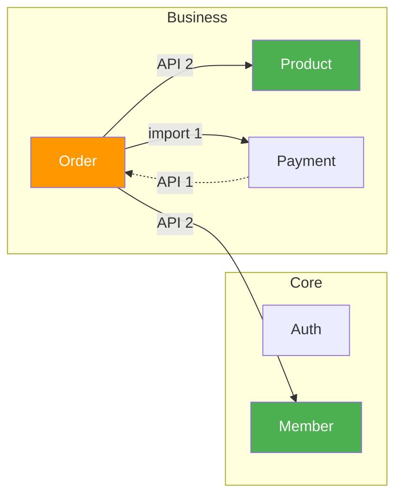

# Dependency Graph (의존성 그래프 분석)

> **목적**: 프로젝트의 **의존성 관계를 시각화**하고, **순환 의존성을 감지**하며,
> **도메인 간 결합도를 분석**하여 아키텍처 건전성을 유지합니다.
>
> **Impact 스킬과의 관계**: `/impact`는 **단일 파일**의 영향도를 분석하고,
> `/deps`는 **도메인/디렉토리 단위**의 구조적 의존성을 시각화합니다.
>
> | 구분 | `/impact` | `/deps` |
> |------|-----------|---------|
> | 분석 단위 | 단일 파일 | 도메인/디렉토리/프로젝트 전체 |
> | 주요 출력 | 영향도 리포트 | Mermaid 다이어그램 + 매트릭스 |
> | 핵심 기능 | 변경 영향 범위 추적 | 순환 의존성 감지, 결합도 분석 |
> | 용도 | 수정 전 사전 분석 | 아키텍처 리뷰, 리팩토링 계획 |

---

## 스킬 발동 조건

다음 명령어 또는 자연어로 이 스킬을 호출할 수 있습니다:

- `/deps` - 전체 도메인 의존성 분석
- `/deps <도메인 또는 디렉토리>` - 특정 도메인/디렉토리 의존성
- `/deps --cycles` - 순환 의존성만 감지
- `/deps <파일경로> --tree` - 특정 파일의 의존성 트리
- `/deps --matrix` - 도메인 간 의존성 매트릭스
- `/의존성` - 전체 의존성 분석
- "의존성 그래프 보여줘"
- "순환 의존성 있는지 확인해줘"
- "이 도메인이 어디에 의존하는지 알려줘"

---

## 절대 금지 사항

1. **코드를 직접 수정하지 마세요** - 이 스킬은 분석 전용입니다.
2. **추측으로 의존성을 판단하지 마세요** - 반드시 실제 import/require 구문을 파싱하세요.
3. **존재하지 않는 파일을 의존성에 포함하지 마세요** - 실제 탐색 결과만 사용하세요.
4. **순환 의존성을 무시하지 마세요** - 발견 시 반드시 보고하세요.

---

## 실행 단계 (Execution Steps)

이 스킬이 발동되면 다음 순서로 작업을 수행합니다:

```
/deps [대상] [옵션] 수신
    |
    v
[1] 대상 범위 결정 (Scope Resolution)
    |
    v
[2] 도메인 구조 탐색 (Domain Discovery)
    |
    v
[3] Import/Require 파싱 (Dependency Extraction)
    |
    v
[4] 의존성 그래프 구축 (Graph Construction)
    |
    v
[5] 순환 의존성 감지 (Cycle Detection)
    |
    v
[6] 도메인 간 의존성 분석 (Cross-Domain Analysis)
    |
    v
[7] 결과 출력 (옵션에 따라 분기)
    |
    ├── 기본: Mermaid 다이어그램 + 요약
    ├── --cycles: 순환 의존성 목록만
    ├── --tree: 파일 의존성 트리
    └── --matrix: 도메인 간 매트릭스
```

---

### 1단계: 대상 범위 결정 (Scope Resolution)

사용자 입력에 따라 분석 범위를 결정합니다.

| 입력 | 범위 | 예시 |
|------|------|------|
| (없음) | 프로젝트 전체 도메인 | `/deps` |
| 도메인명 | 해당 도메인 내부 + 외부 의존성 | `/deps order` |
| 디렉토리 경로 | 해당 디렉토리 범위 | `/deps src/services/` |
| 파일 경로 + `--tree` | 해당 파일의 의존성 트리 | `/deps src/api/user.py --tree` |

**범위 결정 로직:**

1. 입력이 없으면: 프로젝트 루트에서 전체 도메인 스캔
2. 경로가 디렉토리이면: 해당 디렉토리를 분석 범위로 설정
3. 경로가 파일이면: `--tree` 모드로 해당 파일의 의존성 트리 생성
4. 이름만 주어지면: 도메인명으로 해석 (`.claude/project-team.yaml` 또는 디렉토리 탐색)

```bash
# 프로젝트 구조 파악
ls -d */ src/*/ 2>/dev/null

# 프로젝트 팀 설정 확인 (도메인 정의가 있는 경우)
cat .claude/project-team.yaml 2>/dev/null
```

### 2단계: 도메인 구조 탐색 (Domain Discovery)

프로젝트의 도메인 경계를 식별합니다.

**도메인 식별 기준 (우선순위 순):**

1. `.claude/project-team.yaml`에 `domains` 정의가 있으면 해당 설정 사용
2. `domains/<도메인명>/` 디렉토리 구조
3. `src/<도메인명>/` 디렉토리 구조
4. `app/<도메인명>/` 디렉토리 구조
5. 최상위 의미 있는 디렉토리 (services, models, api 등은 도메인이 아닌 레이어)

**레이어 vs 도메인 구분:**

```
레이어 (도메인이 아님): api/, services/, models/, schemas/, repositories/, utils/, config/
도메인 (분석 대상): order/, member/, product/, payment/, auth/, notification/ 등
```

```bash
# 도메인 후보 디렉토리 탐색
# 프로젝트 구조에 따라 탐색 경로를 조정

# DDD 구조: domains/ 하위
ls domains/ 2>/dev/null

# Flat 구조: src/ 하위에서 레이어가 아닌 디렉토리
ls src/ 2>/dev/null

# Django 구조: 앱 디렉토리
ls */apps.py 2>/dev/null
```

### 3단계: Import/Require 파싱 (Dependency Extraction)

각 소스 파일에서 의존성 정보를 추출합니다.

**지원하는 언어 및 패턴:**

| 언어 | import 패턴 | 예시 |
|------|-------------|------|
| Python | `from x.y import z` | `from order.services.order_service import OrderService` |
| Python | `from .relative import z` | `from .models import Order` |
| Python | `import x.y.z` | `import order.services.order_service` |
| JS/TS | `import ... from '...'` | `import { OrderService } from '../order/services'` |
| JS/TS | `require('...')` | `const order = require('../order/services')` |
| JS/TS | `import('...')` (dynamic) | `const mod = await import('../order/services')` |
| Go | `import "..."` | `import "myapp/order/services"` |
| Java | `import x.y.z` | `import com.myapp.order.services.OrderService` |

**실행 방법:**

```bash
# Python: 도메인 간 참조 추출
grep -rn "^from \|^import " --include="*.py" <대상경로>

# JS/TS: import/require 추출
grep -rn "import.*from\|require(" --include="*.ts" --include="*.js" --include="*.tsx" --include="*.jsx" <대상경로>

# Go: import 추출
grep -rn "^import\|\".*/" --include="*.go" <대상경로>

# Java: import 추출
grep -rn "^import " --include="*.java" <대상경로>
```

**파싱 시 주의사항:**

- 표준 라이브러리 import는 제외 (os, sys, typing, react, express 등)
- node_modules, __pycache__, .venv 하위 파일은 제외
- 주석 내 import 구문은 제외
- 상대 경로 import는 절대 경로로 변환하여 분석

### 4단계: 의존성 그래프 구축 (Graph Construction)

추출된 의존성 정보를 그래프 구조로 변환합니다.

**그래프 구조:**

```
노드 (Node): 도메인 또는 모듈
엣지 (Edge): 의존 관계 (방향 있음)
  - from: 의존하는 쪽
  - to: 의존받는 쪽
  - weight: 의존하는 import 개수
  - details: 구체적 import 목록
```

**그래프 구축 절차:**

1. 각 소스 파일의 import를 파싱하여 `(소스 모듈, 대상 모듈)` 쌍 생성
2. 모듈을 도메인으로 매핑 (파일 경로 -> 소속 도메인)
3. 동일 도메인 내부 의존성은 "내부"로 분류
4. 서로 다른 도메인 간 의존성은 "교차"로 분류
5. 엣지에 API 호출 관계도 추가 (간접 의존성)

### 5단계: 순환 의존성 감지 (Cycle Detection)

구축된 그래프에서 순환 의존성을 탐지합니다.

**감지 대상:**

| 레벨 | 설명 | 심각도 |
|------|------|--------|
| 도메인 레벨 순환 | 도메인 A -> B -> A | CRITICAL |
| 모듈 레벨 순환 | 모듈 A -> B -> C -> A | HIGH |
| 파일 레벨 순환 | 파일 A <-> B | MEDIUM |

**감지 알고리즘 (DFS 기반):**

의존성 그래프에서 깊이 우선 탐색(DFS)을 수행하며 back edge를 찾습니다.

```
순환 감지 절차:
1. 모든 노드를 "미방문" 상태로 초기화
2. 각 미방문 노드에서 DFS 시작
3. DFS 진행 중 "방문 중" 상태인 노드를 다시 만나면 -> 순환!
4. 순환 경로를 기록 (A -> B -> C -> A)
5. 모든 노드 탐색 완료 후 결과 반환
```

**실행 방법:**

```bash
# 도메인 간 순환 확인을 위한 교차 참조 탐색

# 예: order 도메인이 payment를 참조하는지
grep -rn "from payment\|import payment" --include="*.py" order/

# 예: payment 도메인이 order를 참조하는지 (역방향)
grep -rn "from order\|import order" --include="*.py" payment/

# 양방향 참조가 모두 존재하면 순환 의존성
```

### 6단계: 도메인 간 의존성 분석 (Cross-Domain Analysis)

도메인 사이의 결합도를 정량적으로 분석합니다.

**분석 지표:**

| 지표 | 설명 | 계산 방법 |
|------|------|-----------|
| Afferent Coupling (Ca) | 이 도메인에 의존하는 외부 도메인 수 | 들어오는 엣지 수 |
| Efferent Coupling (Ce) | 이 도메인이 의존하는 외부 도메인 수 | 나가는 엣지 수 |
| Instability (I) | 불안정성 지표 | Ce / (Ca + Ce) |
| 교차 의존 API 수 | 도메인 간 API 호출 수 | API 엔드포인트 참조 수 |

**불안정성 해석:**

```
I = 0.0: 완전히 안정 (다른 도메인이 많이 의존, 변경 시 영향 큼)
I = 1.0: 완전히 불안정 (다른 도메인에 많이 의존, 변경이 용이)
I = 0.5: 중간 (균형 잡힌 상태)
```

**결합도 등급:**

| 등급 | 교차 의존 수 | 평가 |
|------|-------------|------|
| Loose (느슨) | 0-2개 | 건전한 상태 |
| Moderate (보통) | 3-5개 | 관리 가능 |
| Tight (밀접) | 6-10개 | 리팩토링 검토 권장 |
| Tangled (얽힘) | 11개 이상 | 리팩토링 필수 |

### 7단계: 결과 출력

옵션에 따라 적절한 형식으로 결과를 출력합니다.

---

## 출력 형식

### 기본 출력: 도메인 의존성 (`/deps` 또는 `/deps <도메인>`)

```
===========================================================
  Dependency Graph: <대상>
===========================================================

  Scope: <전체 프로젝트|도메인명|디렉토리 경로>
  Domains Found: <N>개
  Total Cross-Domain Dependencies: <N>개
  Circular Dependencies: <있음/없음>

-----------------------------------------------------------
  Mermaid Diagram
-----------------------------------------------------------

  ```mermaid
  graph LR
    order["Order<br/>(Ca:2, Ce:3, I:0.60)"]
    member["Member<br/>(Ca:3, Ce:1, I:0.25)"]
    product["Product<br/>(Ca:2, Ce:0, I:0.00)"]
    payment["Payment<br/>(Ca:0, Ce:2, I:1.00)"]

    order -->|"API 2"| member
    order -->|"API 2"| product
    order -->|"import 1"| payment
    payment -->|"API 1"| order

    style product fill:#4CAF50,color:#fff
    style payment fill:#FF9800,color:#fff
  ```

-----------------------------------------------------------
  Domain Summary
-----------------------------------------------------------

  | Domain   | Ca | Ce | I    | Grade    |
  |----------|----|----|------|----------|
  | member   | 3  | 1  | 0.25 | Loose    |
  | product  | 2  | 0  | 0.00 | Loose    |
  | order    | 2  | 3  | 0.60 | Moderate |
  | payment  | 0  | 2  | 1.00 | Loose    |

===========================================================
```

### 특정 도메인 의존성 (`/deps show <도메인>`)

설계 문서 Section 12.5의 출력 형식을 따릅니다:

```
===========================================================
  Dependency Graph: <도메인명> Domain
===========================================================

  <도메인명> 도메인 의존성:

-----------------------------------------------------------
  [의존하는 것] (이 도메인이 사용하는 외부 의존성)
-----------------------------------------------------------
  +-- <도메인A> (API <N>개)
  |   +-- <METHOD> /<경로> - <설명>
  |   +-- <METHOD> /<경로> - <설명>
  +-- <도메인B> (import <N>개)
      +-- <모듈경로> - <클래스/함수명>

-----------------------------------------------------------
  [의존받는 것] (이 도메인을 사용하는 외부 의존성)
-----------------------------------------------------------
  +-- <도메인C> (API <N>개)
      +-- <METHOD> /<경로> - <설명>

-----------------------------------------------------------
  [순환 의존성]
-----------------------------------------------------------
  +-- 없음

===========================================================
```

### 순환 의존성 전용 (`/deps --cycles`)

```
===========================================================
  Circular Dependency Report
===========================================================

  Total Cycles Found: <N>

-----------------------------------------------------------
  [CRITICAL] Domain-Level Cycles
-----------------------------------------------------------

  Cycle 1:
    order -> payment -> order
    |
    +-- order/services/checkout.py:L15
    |     from payment.services.payment_service import process
    +-- payment/services/refund.py:L8
          from order.services.order_service import get_order

  Cycle 2:
    auth -> user -> auth
    |
    +-- auth/services/auth_service.py:L12
    |     from user.models.user import User
    +-- user/services/user_service.py:L5
          from auth.utils.token import verify_token

-----------------------------------------------------------
  [HIGH] Module-Level Cycles
-----------------------------------------------------------

  Cycle 1:
    order.services.order_service -> order.services.discount_service
                                 -> order.services.order_service
    |
    +-- order/services/order_service.py:L20
    |     from .discount_service import calculate_discount
    +-- order/services/discount_service.py:L8
          from .order_service import get_order_total

-----------------------------------------------------------
  [MEDIUM] File-Level Cycles
-----------------------------------------------------------

  None found

-----------------------------------------------------------
  Recommendations
-----------------------------------------------------------

  1. [CRITICAL] order <-> payment:
     - payment에서 order 참조 제거 권장
     - 이벤트 기반 통신 또는 공유 인터페이스 도입 검토
     - 참조: Dependency Inversion Principle (DIP)

  2. [CRITICAL] auth <-> user:
     - 공통 모듈(shared/auth_types)로 의존성 분리 권장
     - user가 auth 유틸을 직접 참조하지 않도록 수정

  3. [HIGH] order.services 내부 순환:
     - 함수를 별도 모듈로 분리하거나, 한쪽의 import를 제거
     - 지연 import(lazy import) 패턴 적용 검토

===========================================================
```

### 파일 의존성 트리 (`/deps <파일> --tree`)

```
===========================================================
  Dependency Tree: <파일경로>
===========================================================

  [이 파일이 의존하는 것] (Outgoing)
  <파일명>
  +-- <import 1> (<도메인>)
  |   +-- <import 1-1> (<도메인>)
  |   +-- <import 1-2> (<도메인>)
  +-- <import 2> (<도메인>)
  |   +-- <import 2-1> (<도메인>)
  +-- <import 3> (표준 라이브러리 - 생략)

  [이 파일에 의존하는 것] (Incoming)
  <파일명>
  +-- <dependent 1> (<도메인>)
  |   +-- <dependent 1-1> (<도메인>)
  +-- <dependent 2> (<도메인>)

  Tree Depth: <N> levels
  Total Unique Dependencies: <N> files
  Cross-Domain References: <N>

===========================================================
```

### 도메인 간 의존성 매트릭스 (`/deps --matrix`)

```
===========================================================
  Cross-Domain Dependency Matrix
===========================================================

  (행: 의존하는 쪽 -> 열: 의존받는 쪽)

  |          | order | member | product | payment | auth |
  |----------|-------|--------|---------|---------|------|
  | order    |   -   |   2    |    2    |    1    |  1   |
  | member   |   0   |   -    |    0    |    0    |  1   |
  | product  |   0   |   0    |    -    |    0    |  0   |
  | payment  |   1   |   0    |    0    |    -    |  1   |
  | auth     |   0   |   1    |    0    |    0    |  -   |

  Legend:
    숫자 = 교차 의존성 수 (import + API 호출)
    0    = 의존 관계 없음
    -    = 자기 자신 (내부 의존성)

-----------------------------------------------------------
  Hotspots (높은 결합도)
-----------------------------------------------------------
  1. order -> member (2): API 호출 2건
  2. order -> product (2): API 호출 2건
  3. payment -> order (1): import 1건 [순환 주의]

-----------------------------------------------------------
  Isolated Domains (독립적)
-----------------------------------------------------------
  - product: 외부 의존성 없음 (Ce=0, 가장 안정적)

===========================================================
```

---

## 아키텍처 파일 생성

분석 결과를 프로젝트의 아키텍처 문서로 저장합니다.

### 저장 경로

```
.claude/architecture/
└── dependencies/
    ├── domain-graph.mmd         # Mermaid 다이어그램
    ├── module-graph.json        # 모듈 레벨 의존성
    └── api-graph.json           # API 호출 관계
```

### domain-graph.mmd (Mermaid 형식)



### module-graph.json (JSON 형식)

```json
{
  "generated": "2026-02-07T12:00:00Z",
  "nodes": [
    { "id": "order", "type": "domain", "files": 12, "ca": 2, "ce": 3, "instability": 0.60 },
    { "id": "member", "type": "domain", "files": 8, "ca": 3, "ce": 1, "instability": 0.25 }
  ],
  "edges": [
    { "from": "order", "to": "member", "weight": 2, "type": "api", "details": ["GET /members/{id}", "GET /members/{id}/grade"] },
    { "from": "order", "to": "product", "weight": 2, "type": "api", "details": ["GET /products/{id}", "PATCH /products/{id}/stock"] }
  ],
  "cycles": []
}
```

### api-graph.json (API 호출 관계)

```json
{
  "generated": "2026-02-07T12:00:00Z",
  "endpoints": [
    { "method": "GET", "path": "/members/{id}", "domain": "member", "callers": ["order"] },
    { "method": "GET", "path": "/products/{id}", "domain": "product", "callers": ["order"] },
    { "method": "GET", "path": "/orders/{id}", "domain": "order", "callers": ["payment"] }
  ]
}
```

사용자가 `/deps` 분석을 실행할 때마다 이 파일들을 갱신합니다. 파일이 없으면 새로 생성하고, 있으면 최신 분석 결과로 덮어씁니다.

---

## 사용 예시

### 예시 1: 전체 도메인 의존성 분석

```
> /deps

===========================================================
  Dependency Graph: Full Project
===========================================================

  Scope: 전체 프로젝트
  Domains Found: 5개 (order, member, product, payment, auth)
  Total Cross-Domain Dependencies: 8개
  Circular Dependencies: 없음

-----------------------------------------------------------
  Mermaid Diagram
-----------------------------------------------------------

  ```mermaid
  graph LR
    order["Order<br/>(Ca:1, Ce:3, I:0.75)"]
    member["Member<br/>(Ca:2, Ce:1, I:0.33)"]
    product["Product<br/>(Ca:2, Ce:0, I:0.00)"]
    payment["Payment<br/>(Ca:1, Ce:2, I:0.67)"]
    auth["Auth<br/>(Ca:3, Ce:0, I:0.00)"]

    order -->|"API 2"| member
    order -->|"API 2"| product
    order -->|"import 1"| auth
    payment -->|"API 1"| order
    payment -->|"import 1"| auth
    member -->|"import 1"| auth

    style product fill:#4CAF50,color:#fff
    style auth fill:#4CAF50,color:#fff
    style payment fill:#FF9800,color:#fff
  ```

-----------------------------------------------------------
  Domain Summary
-----------------------------------------------------------

  | Domain   | Ca | Ce | I    | Grade    | Assessment           |
  |----------|----|----|------|----------|----------------------|
  | auth     | 3  | 0  | 0.00 | Loose    | 가장 안정적 (기반 모듈) |
  | product  | 2  | 0  | 0.00 | Loose    | 안정적 (순수 도메인)    |
  | member   | 2  | 1  | 0.33 | Loose    | 안정적                 |
  | payment  | 1  | 2  | 0.67 | Moderate | 보통 (의존성 관리 필요)  |
  | order    | 1  | 3  | 0.75 | Moderate | 높은 의존성 (핵심 도메인) |

  [Architecture Health: GOOD]
  순환 의존성 없음. 결합도가 관리 가능한 수준입니다.

===========================================================
```

### 예시 2: 특정 도메인 의존성 (`/deps show order`)

```
> /deps show order

===========================================================
  Dependency Graph: Order Domain
===========================================================

  Order 도메인 의존성:

-----------------------------------------------------------
  [의존하는 것] (Order가 사용하는 외부 의존성)
-----------------------------------------------------------
  +-- member (API 2개)
  |   +-- GET /members/{id} - 회원 정보 조회
  |   +-- GET /members/{id}/grade - 등급 조회
  +-- product (API 2개)
  |   +-- GET /products/{id} - 상품 정보 조회
  |   +-- PATCH /products/{id}/stock - 재고 차감
  +-- auth (import 1개)
      +-- auth.utils.token.verify_token - 토큰 검증

-----------------------------------------------------------
  [의존받는 것] (Order를 사용하는 외부 의존성)
-----------------------------------------------------------
  +-- payment (API 1개)
      +-- GET /orders/{id} - 주문 확인

-----------------------------------------------------------
  [순환 의존성]
-----------------------------------------------------------
  +-- 없음

-----------------------------------------------------------
  Metrics
-----------------------------------------------------------
  Afferent Coupling (Ca): 1
  Efferent Coupling (Ce): 3
  Instability (I): 0.75
  Grade: Moderate

  [NOTE] Order 도메인은 다수의 외부 도메인에 의존합니다.
  핵심 비즈니스 도메인으로서 적절한 수준이나,
  의존성이 더 증가하면 인터페이스 분리를 검토하세요.

===========================================================
```

### 예시 3: 순환 의존성 감지

```
> /deps --cycles

===========================================================
  Circular Dependency Report
===========================================================

  Total Cycles Found: 0

  순환 의존성이 발견되지 않았습니다.
  아키텍처가 건전한 상태입니다.

===========================================================
```

### 예시 4: 파일 의존성 트리

```
> /deps src/services/order_service.py --tree

===========================================================
  Dependency Tree: order_service.py
===========================================================

  [이 파일이 의존하는 것] (Outgoing)
  order_service.py
  +-- member.services.member_service (member)
  |   +-- member.models.member (member)
  |   +-- auth.utils.token (auth)
  +-- product.services.product_service (product)
  |   +-- product.models.product (product)
  +-- order.models.order (order - 내부)
  +-- order.schemas.order_schema (order - 내부)

  [이 파일에 의존하는 것] (Incoming)
  order_service.py
  +-- order.api.routes.order_router (order - 내부)
  +-- payment.services.checkout_service (payment)
      +-- payment.api.routes.payment_router (payment - 내부)

  Tree Depth: 2 levels
  Total Unique Dependencies: 8 files
  Cross-Domain References: 4 (member: 2, product: 1, payment: 1)

===========================================================
```

### 예시 5: 도메인 간 매트릭스

```
> /deps --matrix

===========================================================
  Cross-Domain Dependency Matrix
===========================================================

  |          | order | member | product | payment | auth |
  |----------|-------|--------|---------|---------|------|
  | order    |   -   |   2    |    2    |    0    |  1   |
  | member   |   0   |   -    |    0    |    0    |  1   |
  | product  |   0   |   0    |    -    |    0    |  0   |
  | payment  |   1   |   0    |    0    |    -    |  1   |
  | auth     |   0   |   0    |    0    |    0    |  -   |

  Hotspots:
  1. order -> member (2): 가장 높은 결합도
  2. order -> product (2): 동일 수준

  Isolated:
  - product: 외부 의존성 없음 (Ce=0)
  - auth: 외부 의존성 없음 (Ce=0)

===========================================================
```

---

## 고급 옵션

### 언어 자동 감지

프로젝트의 주요 언어를 자동으로 감지하여 적절한 import 파싱 전략을 선택합니다:

```bash
# 언어 감지: 파일 확장자 기반
# .py가 다수 -> Python 프로젝트
# .ts/.tsx가 다수 -> TypeScript 프로젝트
# .go가 다수 -> Go 프로젝트
```

| 감지된 언어 | import 패턴 | 모듈 경로 규칙 |
|-------------|-------------|----------------|
| Python | from/import | 점(.) 기반 모듈 경로 |
| TypeScript/JavaScript | import/require | 상대 경로 또는 alias |
| Go | import "..." | 패키지 경로 |
| Java | import x.y.z | 패키지 기반 |

### 필터링 옵션

```
/deps --exclude=tests,docs     # 특정 디렉토리 제외
/deps --depth=1                # 1단계 의존성만 (직접 의존)
/deps --depth=2                # 2단계까지 (간접 의존 포함)
/deps --type=api               # API 호출 관계만
/deps --type=import            # import 관계만
```

### 변경 감지 모드

```
/deps --diff                   # 마지막 분석 이후 변경된 의존성만 표시
/deps --since=7d               # 최근 7일간 변경된 의존성
```

이 옵션은 `.claude/architecture/dependencies/` 의 이전 분석 결과와 비교합니다.

---

## 관련 스킬 연동

| 스킬 | 연동 시점 | 용도 |
|------|-----------|------|
| `/impact <file>` | 순환 의존성 발견 시 | 해당 파일 수정 시 영향도 확인 |
| `/changelog <domain>` | 도메인 의존성 변경 시 | 최근 변경 이력 확인 |
| `/coverage <file>` | 높은 결합도 발견 시 | 테스트 커버리지 확인 |
| `/architecture` | 전체 분석 완료 후 | 아키텍처 문서 업데이트 |

### 연동 워크플로우

```
1. /deps --cycles                # 순환 의존성 확인
2. /deps order                   # 문제 도메인 상세 분석
3. /impact <문제 파일>           # 수정 시 영향도 확인
4. 코드 수정                     # 순환 의존성 해소
5. /deps --cycles                # 해소 확인
```

---

## 구현 시 참조 파일

| 파일 | 경로 | 용도 |
|------|------|------|
| Impact Skill | `claude-project-team/skills/impact/SKILL.md` | 관련 스킬 (파일 단위 분석) |
| Impact Check Hook | `claude-project-team/hooks/pre-edit-impact-check.js` | import 파싱 로직 참조 |
| Project Team Config | `.claude/project-team.yaml` (선택) | 도메인 정의 |
| Architecture Dir | `.claude/architecture/dependencies/` | 분석 결과 저장 |

---

## 설계 문서 참조

- **Section 12.1**: 유지보수 레이어 개요
- **Section 12.5**: Dependency Graph 상세 명세
- **Section 12.9**: 유지보수 워크플로우
- **Section 12.11**: 유지보수 스킬 목록
